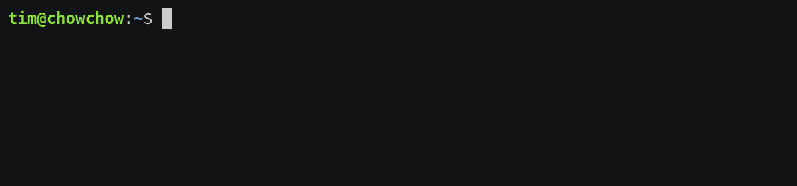

# lwc

[](https://goreportcard.com/report/github.com/timdp/lwc-golang) [](https://github.com/timdp/lwc-golang/releases/latest)

A live-updating version of the UNIX [`wc` command](https://en.wikipedia.org/wiki/Wc_(Unix)).



**This is the Go version of lwc. You may also be interested in the
[Node.js version](https://github.com/timdp/lwc-nodejs).**

## Installation

You can get a prebuilt binary for every major platform from the
[Releases page](https://github.com/timdp/lwc-golang/releases). Just extract it
somewhere under your `PATH` and you're good to go.

Alternatively, use `go get` to build from source:

```bash
go get -u github.com/timdp/lwc-golang/cmd/lwc
```

## Usage

```
lwc [OPTION]...
```

Without any options, `lwc` will count the number of lines, words, and bytes
in standard input, and write them to standard output. Contrary to `wc`, it will
also update standard output while it is still counting.

The following [`wc` options](https://en.wikipedia.org/wiki/Wc_(Unix)) are
currently supported:

- `--lines` or `-l`
- `--words` or `-w`
- `--chars` or `-m`
- `--bytes` or `-c`

## Examples

Count the number of lines in a big file:

```bash
lwc --lines < big-file
```

Run a slow command and count the number of bytes logged:

```bash
slow-command | lwc --bytes
```

## TODO

- Support `--help`
- Support `--max-line-length`
- Support `--files0-from`
- Add tests

## Author

[Tim De Pauw](https://tmdpw.eu/)

## License

MIT
